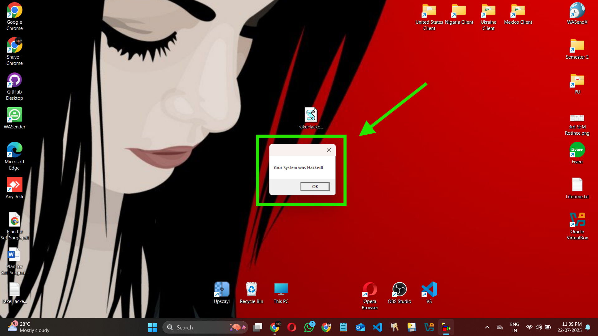

<h1 align="center">💀 FakeHackedPopup - Infinite MsgBox Prank (VBScript)</h1>

  
  
  

  

<h3>🧠 What is This?</h3>

  <strong>FakeHackedPopup</strong> is a fun little VBScript prank that creates an <code>infinite loop</code> of message boxes saying:  
  <code>"Your System was Hacked!"</code> 😈  
  It looks scary, but it's totally harmless. Just made for fun or to spook your friends!

<h3>💡 How It Works</h3>
<pre>
do
    msgbox "Your System was Hacked!"
loop
</pre>

This VBScript uses an infinite <code>Do...Loop</code> and repeatedly shows a message box popup.

<h3>🛠️ What File Extension to Use?</h3>

  Save the script with a <code>.vbs</code> extension (not .txt) 
  ✅ Example: <strong>FakeHackedPopup.vbs</strong>

<h3>🚀 How to Run</h3>
<ol>
  <li>Open <strong>Notepad</strong></li>
  <li>Paste the code into it</li>
  <li>Save the file as <code>FakeHackedPopup.vbs</code></li>
  <li>Double-click to run (Windows only)</li>
</ol>

<h3>🛑 How to Stop the Script</h3>
<ol>
  <li>Press <kbd>Ctrl</kbd> + <kbd>Shift</kbd> + <kbd>Esc</kbd> to open <strong>Task Manager</strong></li>
  <li>Find the process: <code>wscript.exe</code> or <code>cscript.exe</code></li>
  <li>Right-click and choose <strong>End Task</strong></li>
</ol>

<h3>⚠️ Disclaimer</h3>

  This project is created for educational and entertainment purposes only. 
  <strong>DO NOT</strong> use this to annoy or harm anyone. Always use it responsibly.

<h3>📁 Included Files</h3>
<ul>
  <li><strong>FakeHackedPopup.vbs</strong> — The main prank script</li>
  <li><strong>FakeHackedPopup.txt</strong> — Optional plain text version</li>
  <li><strong>FakeHackedPopup-preview.png</strong> — Preview image used in this README</li>
  <li><strong>README.md</strong> — This file (GitHub description)</li>
  <li><strong>LICENSE</strong> — MIT open-source license</li>
</ul>

<h3>📜 License</h3>

This project is licensed under the <strong>MIT License</strong>. You are free to use, modify, and share.

<h3 align="center">🧑‍💻 Made by <a href="https://engrshuvodas.github.io/SHUVO-_portfolio/" target="_blank">Engr. Shuvo Das</a></h3>

  🌐 <a href="https://engrshuvodas.github.io/SHUVO-_portfolio/" target="_blank">Visit My Portfolio</a>  
  🔗 <a href="https://github.com/engrshuvodas" target="_blank">GitHub Profile</a>

